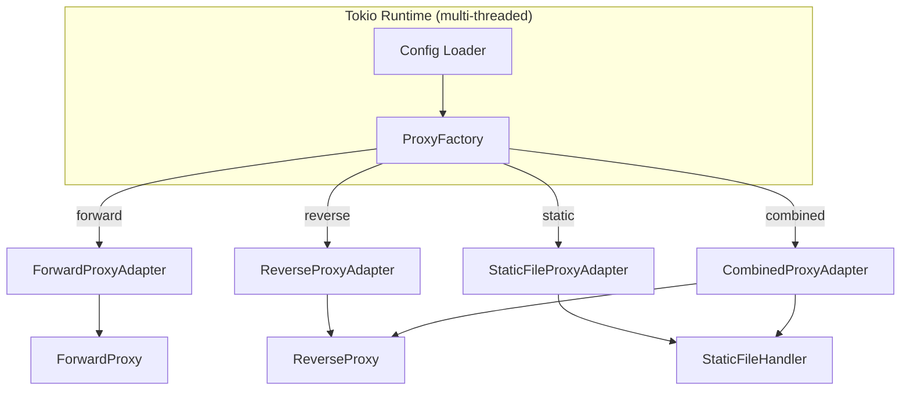
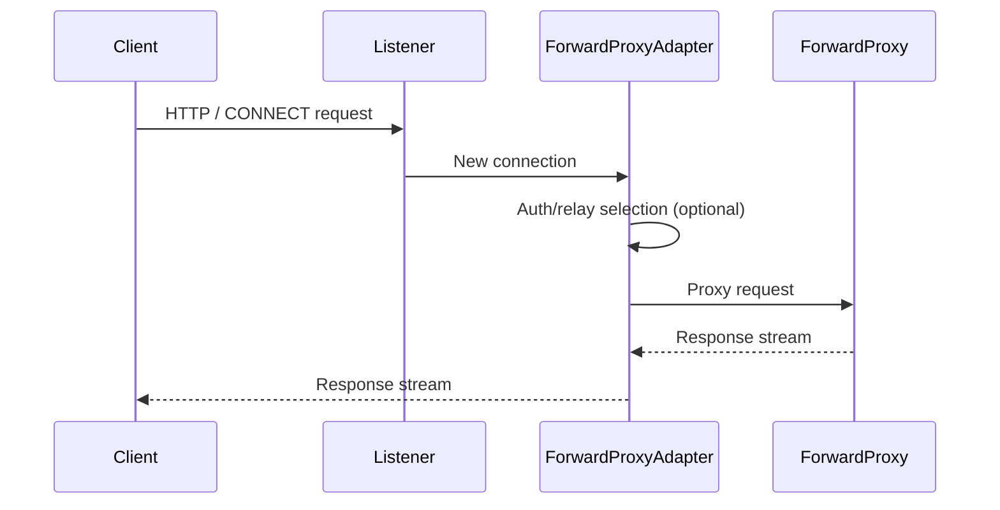
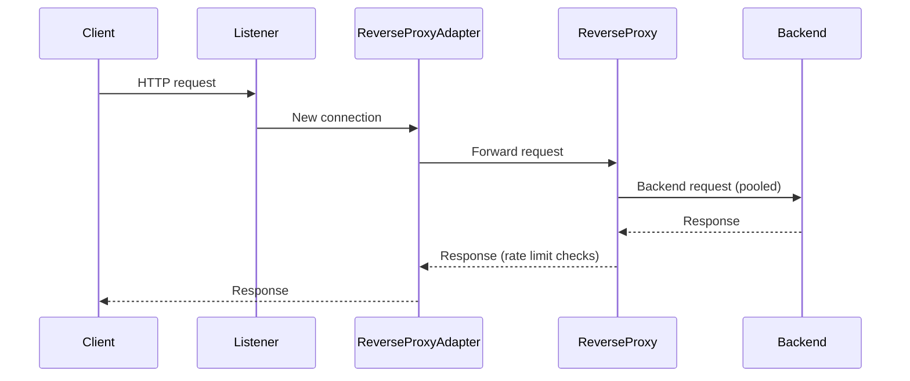
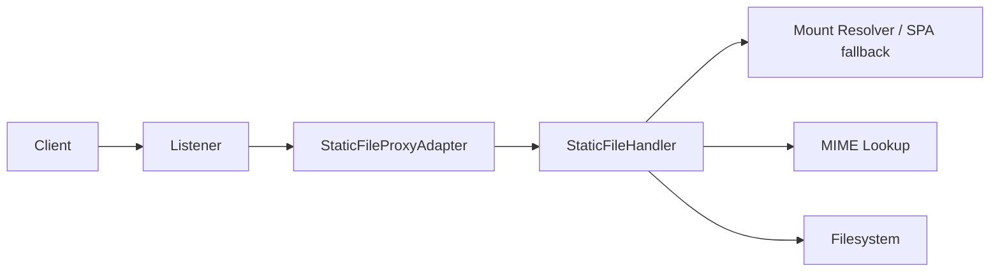
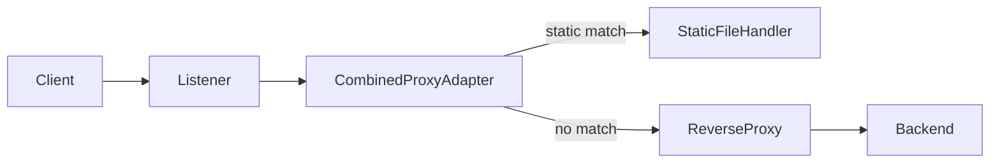

# Architecture Overview

This document explains how Bifrost Bridge is structured today. The binary launches **one** Tokio
runtime, loads configuration from the CLI/JSON file, and creates the single proxy adapter that matches
the requested mode.

Only one adapter runs at a time:

| Mode                      | Adapter                  | Listener Responsibilities                                            |
|---------------------------|--------------------------|-----------------------------------------------------------------------|
| `forward`                 | `ForwardProxyAdapter`    | HTTP/HTTPS CONNECT handling, relay proxies, auth, connection pooling  |
| `reverse` (no static)     | `ReverseProxyAdapter`    | Reverse proxy to backend, pooling, rate limiting                      |
| `reverse` + static only   | `StaticFileProxyAdapter` | Static file serving with SPA fallback and optional HTTPS              |
| `reverse` + static combo  | `CombinedProxyAdapter`   | Routes requests to static handler or backend on the same listener     |

> **Note:** `docs/worker-separation-architecture.md` outlines an experimental multi-worker design.
> That design is not part of the shipping binary today.

## Request Flows

### Forward Proxy

1. Listener accepts HTTP/HTTPS CONNECT traffic.
2. Adapter enforces auth and calls `ForwardProxy`.
3. `ForwardProxy` routes directly or via relay proxies and streams responses back.

### Reverse Proxy

### Static File Mode

### Combined Reverse + Static

1. Adapter inspects the request path using the mount table.
2. Static matches are served locally (with SPA fallbacks).
3. Everything else is proxied to the backend.

## Core Components

### ProxyFactory
- Parses `Config` and builds the adapter for the selected mode.
- Injects shared services (rate limiter, monitoring handles) into adapters.

### Adapters

| Adapter                  | Description                                                                        |
|--------------------------|------------------------------------------------------------------------------------|
| `ForwardProxyAdapter`    | Binds TCP listener, handles TLS if configured, and delegates to `ForwardProxy`.    |
| `ReverseProxyAdapter`    | Binds TCP listener for reverse proxy only traffic.                                 |
| `StaticFileProxyAdapter` | Serves static files only (used when reverse mode lacks a target).                  |
| `CombinedProxyAdapter`   | Shares the listener between reverse proxy and static handler.                      |

### Proxy Implementations
- **ForwardProxy** – Implements HTTP/HTTPS CONNECT, relay proxies, Basic auth, connection pooling,
  and rate limiting hooks.
- **ReverseProxy** – Wraps a Hyper client with pooling, optional backend health checks, SPA-aware
  header rewriting (X-Forwarded-*), and rate limiting.
- **StaticFileHandler** – Resolves mounts, performs filesystem reads, directory listings, SPA fallback,
  and MIME detection. Exposed through the static and combined adapters.

### Cross-Cutting Services
- **Monitoring Server** – Optional Prometheus endpoint; gets the metrics handles created when the
  adapter is built.
- **RateLimiter** – Shared instance enforcing configured rate-limiting rules.
- **Tokio Runtime Configuration** – `worker_threads` (global or static-files-specific) tunes runtime
  worker counts when running reverse/static workloads.

## Lifecycle Summary

1. CLI parses arguments, optionally generates sample configs.
2. Configuration is built/validated.
3. Tokio runtime is created (default or custom worker count).
4. `ProxyFactory::create_proxy` instantiates the adapter.
5. Adapter binds the listener (HTTP or HTTPS) and begins serving.
6. Ctrl+C triggers graceful shutdown via the runtime.

This document captures the **current** architecture. Update it when adapters/runtimes change to keep
technical docs and the codebase aligned.
