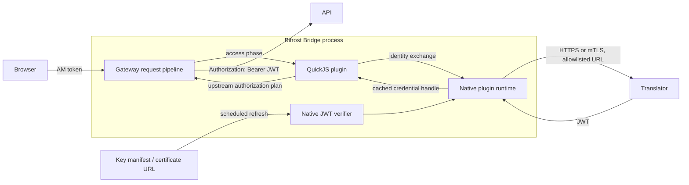

# Plugin Design

**Status:** Partially implemented. Bifrost Bridge loads signed QuickJS access plugins; the identity exchange, sensitive cache, remote JWT verification, and asynchronous host PDK described here remain proposed.

This document describes a programmable gateway extension model for organizations that need
company-specific authentication, authorization, and request transformation. It uses QuickJS for
plugin logic and keeps isolation, networking, secrets, caching, JWT verification, and request
forwarding under Bifrost Bridge control.

See the [glossary](./glossary.md) for shared gateway terminology.

## Goals

- Let each organization implement its own identity flow without changing Bifrost Bridge.
- Attach plugins to a route and run them at defined points in the proxy lifecycle.
- Support AM/OpenAM session or access-token exchange into a short-lived JWT for a downstream API.
- Let a plugin configure its own translation URL and cache semantics.
- Verify JWTs against remotely refreshed public-key manifests, including ordinary JWKS endpoints
  and a single X.509 certificate endpoint.
- Keep credentials, signing keys, and outbound network access out of arbitrary JavaScript unless
  the route's service owner explicitly grants a plugin access to a request header.

## Overview



The **native plugin runtime** and **native JWT verifier** are Bifrost Bridge components written in
Rust; they are not external services. The native plugin runtime executes the QuickJS plugin,
provides its PDK functions, applies resource limits, performs controlled identity HTTP calls, and
stores sensitive cache entries. The native JWT verifier fetches and refreshes public keys, then
verifies token signatures and claims for `ctx.jwt.verify`.

The plugin owns the corporate protocol: its configured translator URL, request/response mapping,
cache key dimensions, cache duration, and authorization decisions. The Bifrost native components
own the mechanics that must remain reliable and secure across all plugins:

| Plugin responsibility | Bifrost native responsibility |
|---|---|
| Translator URL and protocol mapping | TLS policy, DNS and egress policy enforcement |
| Requested resource, audience, and scopes | Async HTTP client, timeout, cancellation, and response size limits |
| Cache key dimensions, tags, and requested TTL | Atomic cache loading, single-flight, eviction, storage encryption, and metrics |
| Claim mapping and access decision | JWT signature and claim verification |
| Header plan within granted permissions | Reserved-header removal and final upstream rewrite |

OAuth token exchange is the preferred semantics when the identity provider supports it: Bifrost
acts as the client, presents a subject token, and requests a credential scoped to the target
resource. See [RFC 8693](https://www.rfc-editor.org/rfc/rfc8693.html).

## Plugin package and route attachment

Each package contains a signed manifest, a JSON schema for its configuration, and a JavaScript
module. A package is loaded and validated during configuration reload. A route references a package
by immutable name and version.

```json
{
  "id": "com.example.openam-exchange",
  "version": "1.2.0",
  "runtime": "quickjs",
  "entrypoint": "index.js",
  "phases": ["access"],
  "capabilities": ["identity.exchange", "cache.sensitive", "upstream.authorization"],
  "configuration_schema": "schema.json",
  "files": {
    "index.js": "BASE64_SHA256_DIGEST",
    "schema.json": "BASE64_SHA256_DIGEST"
  }
}
```

The gateway verifies the package signature against configured publisher keys before activation. The
plugin manifest declares capabilities; route configuration supplies the plugin's validated values,
such as a translator URL, audience, and cache TTL. A deployment may impose additional policies on
permitted package publishers, URL hosts, certificate authorities, and capability combinations.

### Route ownership and plugin composition

The service owner owns every plugin attachment on its route: package selection, configuration,
header grants, and execution priority. Attachments on the same route are therefore an explicitly
configured, trusted composition, not mutually isolated tenants. Most routes should use one plugin;
when a service owner attaches more than one, it must keep the chain small and intentionally design
their priority and data flow.

`permitted_headers` is an explicit raw-header grant for that attachment. A header declared in
plugin A's `credential_headers` is redacted from plugin A and supplied to it only as an HMAC
fingerprint. The service owner may nevertheless grant that same header to plugin B through B's
`permitted_headers`; plugin B then receives the raw header value. This is intentional and does not
depend on execution order. Credential, authorization, and Bifrost-internal headers are still
removed before an allowed request is forwarded upstream.

### Implemented package format

The current binary implements the signed-package loader and the `access` lifecycle. Packages live
below `plugin_runtime.package_dir`; the loader discovers a directory containing `manifest.json`,
`schema.json`, and the configured entrypoint. `manifest.sig` is a base64-encoded Ed25519 detached
signature over the exact bytes of `manifest.json`. The manifest carries a `files` map with a
base64-encoded SHA-256 digest for each payload the runtime reads (`index.js` and the configuration
schema); those bytes are verified and retained before parsing or execution. The manifest also carries a `publisher` field,
which selects a base64-encoded public key from `trusted_publishers`. Signature verification is on
by default and can be disabled only with `require_signatures: false` for local development.

```json
{
  "plugin_runtime": {
    "package_dir": "./plugins",
    "trusted_publishers": {
      "example-security": "BASE64_ED25519_PUBLIC_KEY"
    },
    "memory_limit_bytes": 16777216,
    "execution_timeout_millis": 50,
    "worker_threads": 2
  },
  "reverse_proxy_routes": [{
    "id": "orders-api",
    "target": "https://orders.internal",
    "predicates": [{ "type": "Path", "patterns": ["/**"] }],
    "plugins": [{
      "package": "com.example.access@1.2.0",
      "config": { "role": "orders-reader" },
      "permitted_headers": ["x-request-id"],
      "credential_headers": { "am": "x-am-token" }
    }]
  }]
}
```

An access plugin exports synchronous `access(ctx)`, either as a global function or
`module.exports.access`. It returns `{ outcome: "allow" | "deny" | "error" }`; `deny` may add a
4xx `status` and a lowercase underscore-separated public `code`. With the
`upstream.headers` capability, an allow result may include
`upstream: { headers: { "x-principal-role": "orders-reader" } }`. Reserved, host, and
authorization headers cannot be set by a plugin.

`ctx.request` contains only the configured permitted headers. A header in that same attachment's
`credential_headers` is not exposed in `ctx.request`; `ctx.credentials.fingerprints` instead
contains a per-process HMAC fingerprint for it. As described above, the service owner may
explicitly grant a header to another attachment in the same trusted chain. After access plugins
allow a request, credential, authorization, and Bifrost-internal headers are removed before
forwarding. Package configuration is validated against the package JSON schema while the route is
compiled, so an invalid package, signature, schema, or configuration prevents activation rather
than failing on the first request.

The remaining PDK services in this proposal—identity exchange, sensitive cache, remote JWT key
refresh, and asynchronous host calls—remain follow-on work. A package requiring those services
must not rely on this initial access-only runtime.

The following proposed route configuration is illustrative and is not accepted by the current
binary:

```json
{
  "id": "orders-api",
  "plugins": [{
    "package": "com.example.openam-exchange@1.2.0",
    "config": {
      "translator_url": "https://iam.example.com/token/translate",
      "translator_tls": {
        "client_auth": { "mode": "none" },
        "server_verification": { "mode": "custom_ca", "ca_bundle_ref": "iam-root-ca" }
      },
      "resource": "urn:example:orders-api",
      "scopes": ["orders.read"],
      "cache_ttl_seconds": 20
    }
  }]
}
```

## Request phases

Plugins have a small, ordered lifecycle. Each plugin declares the phases it implements and an
integer priority within that phase. The configuration compiler rejects ambiguous ordering.

| Phase | Purpose | Principal operations |
|---|---|---|
| `ingress` | Normalize an incoming request before routing | Reserved-header removal, trusted-proxy facts |
| `access` | Authenticate and authorize after route selection | Identity exchange, JWT verification, allow or deny |
| `upstream` | Prepare the request sent to the selected target | Approved header changes and credential injection |
| `response` | Apply safe response changes | Approved response headers and audit facts |
| `log` | Emit asynchronous audit/metrics events | Read-only request outcome |

Authentication belongs in `access`, after a route is selected and before a target is contacted. A
route has one logical downstream resource/audience. Routes that represent different resource
servers use separate auth configuration, even if they currently share an upstream host.

An `access` plugin returns one of:

- `allow`: optional principal facts and an upstream action plan;
- `deny`: an HTTP status, safe response headers, and a public error code; or
- `error`: a classified temporary or permanent failure.

The gateway maps invalid credentials to `401`, authorization failure to `403`, and unavailable
identity dependencies to `503`. It does not reveal credentials or internal exception details.

## QuickJS runtime and PDK

QuickJS is a language runtime, not a security boundary by itself. The host creates bounded isolates
on a dedicated worker pool and never runs arbitrary plugin work on a Tokio request worker. Each
invocation has a deadline, cancellation token, memory limit, stack limit, and execution-time
interrupt. QuickJS exposes memory, stack, and interrupt controls that support this model. See the
[QuickJS documentation](https://bellard.org/quickjs/quickjs.html).

The PDK exposes explicit capabilities. It provides no filesystem, process, dynamic-import, raw
socket, or unrestricted HTTP API.

| PDK service | Use |
|---|---|
| `ctx.request` | Read normalized method, path, route facts, and permitted headers. |
| `ctx.credentials` | Obtain a named credential handle and a non-reversible HMAC fingerprint. |
| `ctx.identity.exchange` | Send a credential handle to the plugin's configured identity service and return a verified credential handle plus safe metadata. |
| `ctx.jwt.verify` | Verify a supplied JWT using a named verifier policy. |
| `ctx.cache` | Atomically `getOrLoad`, delete, and invalidate tagged entries in the plugin namespace. |
| `ctx.upstream` | Apply approved upstream headers or set `Authorization` from a bearer-credential handle. |
| `ctx.audit` | Emit structured, redacted security events. |

`identity.exchange` resolves the URL supplied by the plugin configuration. The host still enforces
HTTPS, destination policy, connect/read deadlines, response limits, and the configured TLS policy.
The AM token is represented by a credential handle. It is
never automatically converted to a JavaScript string, log field, cache key, or generic request
header.

Async host operations return JavaScript promises backed by Rust futures. When a client disconnects
or the request deadline expires, Bifrost cancels the outstanding operation and releases the isolate
only after its pending work is settled or terminated.

## Identity exchange and cache ownership

The plugin owns cache semantics because it owns the translator protocol. The cache service adds the
plugin identifier, package version, validated configuration revision, and route identifier to every
namespace. A plugin change or translator URL change therefore cannot reuse credentials created by a
previous policy.

For the AM-to-JWT case, a plugin's semantic key should include:

```text
HMAC(AM token) + AM realm/issuer + translator URL
+ downstream resource/audience + canonical scope set + policy revision
```

The HMAC fingerprint comes from `ctx.credentials`; the raw AM token is never a cache key. The
plugin can add tenant, client, or delegation dimensions when its corporate policy requires them.

The host accepts the plugin's requested TTL only after limiting it to the credential lifetimes:

```text
min(requested TTL, JWT exp - now - clock skew, source credential exp - now - clock skew)
```

For a JWT that expires in 30 seconds, a 20-second requested cache TTL with a five-second clock-skew
margin is a suitable initial policy. `getOrLoad` is single-flight per complete cache key, so a burst
of matching requests produces one translator call. The gateway stores sensitive entries in memory
first, bounds their count and total size, and redacts them from diagnostics. A future shared cache
must provide the same encryption, tenant isolation, and atomic-load guarantees.

Cache failures use these rules:

- A still-valid cached JWT may be used while the translator is temporarily unavailable.
- Bifrost never uses a credential beyond its calculated expiry.
- A short negative cache may protect the translator from repeated invalid credentials.
- Session/logout events may invalidate entries by a plugin-defined tag, such as a session identifier.

The issuer's access-token lifetime is the upper bound on credential misuse after token theft. The
plugin cache window is the normal revocation delay for new gateway requests unless an invalidation
event removes the entry earlier.

## JWT verifier and remote key manifests

JWT verification is a host service used by `ctx.jwt.verify`. A plugin configuration selects a
named verifier policy, including the issuer, audiences, permitted algorithms, key-manifest source,
and refresh behaviour. The key-manifest URL belongs to plugin configuration so each organization can
use its own identity provider and rotation process.

```json
{
  "id": "example-iam-jwt",
  "issuer": "https://iam.example.com/oauth2",
  "audiences": ["urn:example:orders-api"],
  "allowed_algorithms": ["RS256", "ES256"],
  "key_source": {
    "type": "jwks",
    "url": "https://iam.example.com/oauth2/keys",
    "refresh_interval": "1h",
    "max_stale": "2h",
    "request_timeout": "2s",
    "tls": {
      "server_verification": { "mode": "system" }
    }
  },
  "clock_skew": "5s"
}
```

This is a proposed configuration shape. It is intentionally explicit: the verifier never follows a
`jku` or `x5u` URL embedded in an untrusted JWT.

### HTTPS and TLS policy

Translator and key-manifest URLs use HTTPS. Client authentication and server verification are
independent settings. mTLS is optional: many enterprise translators use ordinary HTTPS with no
client certificate.

```json
{
  "translator_tls": {
    "client_auth": {
      "mode": "mtls",
      "certificate_ref": "gateway-client-cert",
      "private_key_ref": "gateway-client-key"
    },
    "server_verification": {
      "mode": "system"
    }
  }
}
```

`client_auth.mode` is one of `none` or `mtls`. `server_verification` is one of:

| Mode | Use |
|---|---|
| `system` | Verify the server chain and hostname with the operating-system trust store. This is the default. |
| `custom_ca` | Verify the server chain and hostname with a configured internal root/intermediate CA bundle. Use it for private PKI or a self-signed enterprise CA. |
| `pinned_certificate` | Verify the server certificate or public-key hash against a configured pin. Use it when a provider publishes a stable leaf certificate. |
| `insecure_skip_verify` | Establish HTTPS without validating the server certificate or hostname. This requires an explicit route/plugin setting and produces a high-severity audit event and metric. |

A CA bundle or pin verifies the remote HTTPS server. A client certificate serves a different
purpose: it identifies Bifrost to that server for mTLS. `custom_ca` and
`pinned_certificate` keep hostname verification enabled; an optional configured `server_name`
supports enterprise endpoints whose connection address differs from their certificate name.

`insecure_skip_verify` exists for legacy enterprise environments and should be scoped to the one
configured service. It is never the default and is not inherited by other plugin egress or key
manifest sources.

### Supported key sources

| `key_source.type` | Response | Key selection |
|---|---|---|
| `jwks` | RFC 7517 JSON Web Key Set containing `keys` | Match JWT `kid` to a usable JWK. |
| `oidc_discovery` | OpenID Connect or OAuth authorization-server metadata | Fetch configured metadata URL, then its configured `jwks_uri`. |
| `certificate` | One PEM or DER X.509 certificate | Use the certificate public key as the sole eligible verification key. |

JWKS entries may carry a bare public key or an `x5c` certificate chain. The verifier accepts only
public signing keys compatible with the configured algorithms. It respects `use: "sig"` and
`key_ops` when supplied, rejects unsupported key types and weak keys, and uses only explicitly
configured algorithms.

The `certificate` source supports issuers that publish one signing certificate rather than a JWKS
document. It is valid when the configured policy permits a missing JWT `kid`; there is exactly one
eligible public key, so verification remains unambiguous. Its HTTPS fetch uses the configured key
source TLS policy. Deployments can use `custom_ca` for private PKI or `pinned_certificate` for a
stronger binding to the expected certificate or public key.

### `kid` handling

`kid` is optional in JWTs and JWKs. The verifier uses the following deterministic selection rules:

1. If the JWT has `kid`, select exactly one compatible configured key with the same `kid`.
2. If the JWT lacks `kid`, verify only when the source has exactly one eligible key and the policy
   sets `allow_missing_kid: true`.
3. If the source has multiple eligible keys and the JWT lacks `kid`, reject the token as ambiguous.
4. If the JWT has an unknown `kid`, initiate one deduplicated on-demand manifest refresh, then retry
   key selection once. A refresh cooldown prevents attacker-controlled `kid` values from causing a
   fetch per request.

The verifier does not try every key in a multi-key set. This avoids ambiguous validation and
unbounded work caused by an attacker-crafted token.

### Refresh, rotation, and failure behaviour

The verifier fetches the initial key source before serving a route that requires it. It refreshes in
the background at `refresh_interval`; one hour is an appropriate default. Fetches use conditional
HTTP requests (`ETag`/`If-None-Match` and `Last-Modified` when available), a small response-size
limit, and per-source single-flight. A successful refresh atomically replaces the active key set.

Key providers should publish the new key alongside the previous key until every JWT made with the
previous key has expired. Bifrost removes keys that disappear from a successful manifest immediately
by default. This lets an issuer revoke a compromised key. A provider-specific retirement grace
period may be configured only when it is no longer than the issuer's maximum JWT lifetime.

On refresh failure, Bifrost continues to use the last successful key set only until `max_stale`.
When no initial manifest was obtained, or when the last successful manifest is older than
`max_stale`, protected requests fail closed with `503`. A failed signature, issuer, audience, time,
or algorithm check returns `401`; it does not use stale data as a fallback.

### JWT checks

For every JWT, the host verifies:

- the expected JWS algorithm from the allowlist, never an algorithm chosen by the JWT alone;
- signature with the selected public key;
- exact issuer and a configured audience;
- `exp`, `nbf`, and configured clock skew; and
- optional application requirements such as token type, subject, client, or scope.

The verifier treats access tokens as secrets in logs and metrics. Downstream services independently
verify the JWT they receive; the gateway's verification is an enforcement point, not a reason to
weaken backend validation. Audience-restricted tokens and sender-constrained tokens through mTLS
are recommended where the identity provider supports them. See
[RFC 9700](https://www.rfc-editor.org/rfc/rfc9700.html).

## Header protection

Before plugins run, Bifrost removes or records externally supplied values for reserved internal
headers. A plugin with `upstream.authorization` may set the upstream `Authorization` header from a
credential handle. The forwarding stage removes the source AM-token header and every configured
internal identity header before the request is sent upstream.

Plugins cannot forge Bifrost's route identity, client connection facts, audit correlation ID, or
trusted forwarded headers. The upstream network should accept traffic only from the gateway or
perform its own JWT validation.

## Observability

The host emits metrics and audit fields without secrets:

- plugin package, version, phase, route, and outcome;
- translator and key-manifest latency, status class, cache hit/miss, and refresh result;
- JWT verifier source, `kid` presence, unknown-key refresh count, and validation failure class;
- cache entry count, eviction count, single-flight waiters, and invalidation count.

Logs include credential fingerprints only when a deployment explicitly permits a redacted correlation
identifier. They never include AM tokens, exchanged JWTs, authorization headers, response bodies, or
private keys.

## Implementation sequence

1. Define package manifests, signature validation, route attachment, and configuration schemas.
2. Add the bounded QuickJS runtime, capability-gated PDK, phase ordering, and reload lifecycle.
3. Add protected egress, credential handles, and sensitive `getOrLoad` caching.
4. Add JWT verification with JWKS, discovery, and single-certificate key sources.
5. Add the first AM/OpenAM exchange plugin and integration tests for key rotation, cache expiry,
   revocation, and failure modes.
